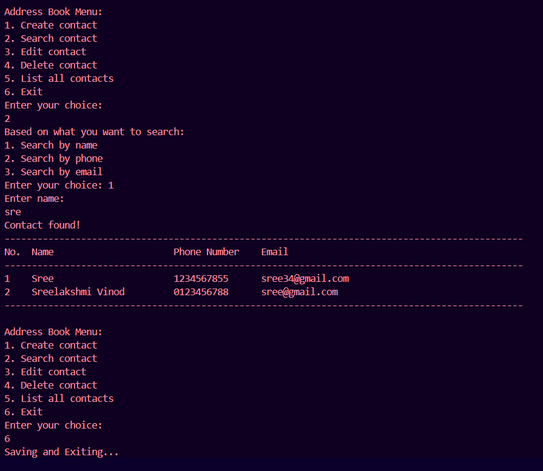

# Address Book in C

A command-line utility to manage a personal contact list, supporting operations like adding, editing, deleting, searching, and listing contacts. It handles contact data persistently using CSV files and allows sorting based on different criteria.

---

## Table of Contents

- [Features](#features)  
- [Prerequisites](#prerequisites)  
- [Building](#building)  
- [Usage](#usage)  
  - [Create Contact](#create-contact)  
  - [Search Contact](#search-contact)  
  - [Edit/Delete Contact](#editdelete-contact)  
  - [List Contacts](#list-contacts)  
- [Project Structure](#project-structure)  
- [Error Handling](#error-handling)
- [Output](#output)
- [License](#license)  
- [Author](#author)  

---

## Features

- Add contacts with name, phone number, and email address  
- Edit or delete existing entries  
- Search contacts by name, phone, or email  
- List contacts sorted by name, phone, or email  
- Input validation and duplicate checking  
- Persistent storage using a CSV file  
- Modular codebase for easy maintainability  

---

## Prerequisites

- GCC or any C99-compatible compiler  
- Basic knowledge of command-line interface  
  

---

## Building

```bash
# Compile the project 
gcc *.c

```

---

## Usage

Run the compiled program:

```bash
./a.out
```

### Create Contact
Adds a new contact with validated name, phone, and email fields.

### Search Contact
Choose to search by:
- Name
- Phone Number
- Email

Displays matched contact(s) with their index.

### Edit/Delete Contact
Allows editing or deleting a contact based on a search result.

### List Contacts
Lists all contacts with optional sorting:
- Sort by Name
- Sort by Phone
- Sort by Email

---

## Project Structure

```
.
├── main.c               # Entry point and user interaction
├── contact.h            # Data structures and function declarations
├── file.c / file.h      # File I/O logic (CSV read/write)
├── populate.c / .h      # Dummy contact loader for testing
├── contact.csv          # Persistent contact storage
└── README.md            # Project documentation
```

---

## Error Handling

- Handles invalid user inputs gracefully  
- Prevents buffer overflows by limiting input lengths  
- Validates phone numbers and email formats  
- Checks for duplicate phone and email entries  
- Ensures file operations are successful before proceeding  

---

## Output

### ✅ Search Contact




---

## License

This project is open-source and free to use under the MIT License.

---

## Author

Sreelakshmi Vinod 

Passionate about embedded systems and low level programming

---

